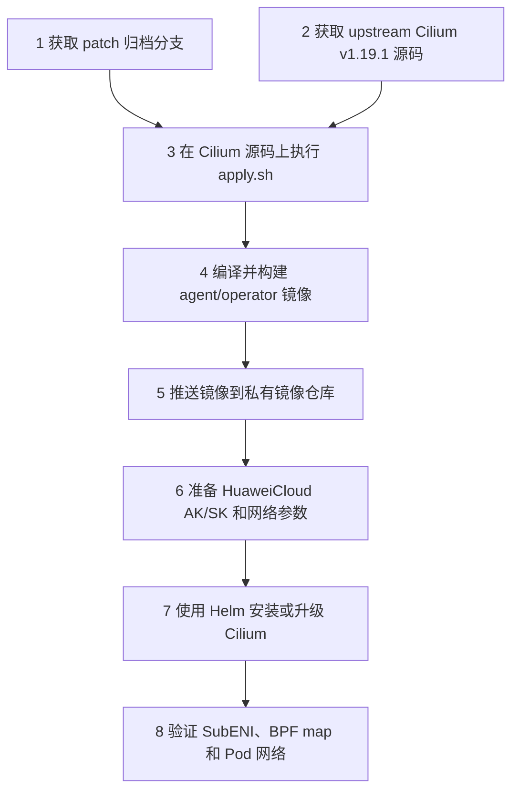

# HuaweiCloud Cilium Patch 安装部署文档

本文档说明如何把本项目中的 HuaweiCloud patch 应用到 upstream Cilium `v1.19.1`，构建镜像，并部署到华为云 Kubernetes 集群。

先明确一个边界：本项目不是一个可以直接部署的 Helm chart，也不是完整 Cilium 源码仓库。它只提供 patch。实际部署时，需要先准备一份干净的 upstream Cilium 源码，把 patch 应用进去，再构建自己的 Cilium 镜像。

## 1. 部署流程总览



可以把整个过程理解成两段：

- **源码准备阶段**：把 HuaweiCloud 改动合入 Cilium 源码，并构建出带 HuaweiCloud 能力的镜像。
- **集群部署阶段**：用这些镜像部署 Cilium，并通过 `ipam.mode=huaweicloud` 启用 HuaweiCloud IPAM。

## 2. 前置条件

### 2.1 本地工具

执行机器需要安装：

- `git`
- `bash`
- `make`
- `docker` 或兼容 Docker CLI 的构建工具
- `helm`
- `kubectl`

如果要构建多架构镜像，还需要可用的 Docker Buildx builder。

### 2.2 Kubernetes 集群

目标集群需要满足：

- 节点运行在华为云 ECS 上。
- 节点所在 VPC、子网、安全组允许创建辅助弹性网卡。
- 节点使用 trunk ENI 承载 SubENI VLAN 流量。
- 集群里不要同时运行另一个会接管 Pod 网络的 CNI。
- kubelet 能正常调用 Cilium CNI。

如果是已有集群升级，先确认原 CNI 的迁移方案。CNI 切换会影响节点上已有 Pod 的网络，不建议直接在生产集群上裸改。

### 2.3 华为云信息

部署前准备这些参数：

| 参数 | 示例 | 说明 |
|---|---|---|
| `HUAWEI_CLOUD_ACCESS_KEY` | `AK...` | 调用华为云 API 的 AK |
| `HUAWEI_CLOUD_SECRET_KEY` | `SK...` | 调用华为云 API 的 SK |
| `HUAWEI_CLOUD_PROJECT_ID` | `0f...` | 华为云项目 ID，必填 |
| `HUAWEI_CLOUD_REGION` | `cn-north-4` | 区域；不填时会尝试从实例元数据推导 |
| `HUAWEI_CLOUD_VPC_ID` | `vpc-...` | VPC ID；不填时会尝试从实例元数据推导 |
| `HUAWEI_CLOUD_ENDPOINT` | `https://...` | 自定义 endpoint，公有云通常不用填 |
| trunk 网卡名 | `eth0` | 节点上承载 SubENI VLAN 的父网卡名 |
| SubENI 子网 ID | `subnet-...` | 用于创建辅助弹性网卡的子网 |
| 安全组 ID | `sg-...` | 新建 SubENI 绑定的安全组 |

建议显式配置 `region`、`vpc id`、子网和安全组。依赖元数据自动推导时，排障会更绕。

## 3. 获取 patch 归档

```bash
git clone -b patch-archive/huaweicloud-v1.19.1 \
  https://github.com/lchany/huawei-cilium-v1.19.1.git \
  huawei-cilium-patches

cd huawei-cilium-patches
ls
```

期望能看到：

```text
0001-huaweicloud-control-plane.patch
0002-huaweicloud-datapath-runtime.patch
0003-huaweicloud-generated-tests-docs.patch
apply.sh
series
README.md
runtime-checklist.md
INSTALL-DEPLOY.md
```

`series` 决定 patch 应用顺序。正常情况下不要手工改顺序。

## 4. 准备 upstream Cilium 源码

另开一个目录，拉取 upstream Cilium：

```bash
git clone https://github.com/cilium/cilium.git cilium-v1.19.1-huaweicloud
cd cilium-v1.19.1-huaweicloud
git checkout d0d0c8792c3420b3a6739fa21e3a182827a0bbc6
```

确认当前 commit：

```bash
git rev-parse HEAD
```

输出必须是：

```text
d0d0c8792c3420b3a6739fa21e3a182827a0bbc6
```

这个检查很重要。`apply.sh` 默认只允许 patch 应用到这个基线，避免把改动打到错误版本。

## 5. 应用 HuaweiCloud patch

在 Cilium 源码根目录执行：

```bash
../huawei-cilium-patches/apply.sh
```

脚本会做三件事：

1. 检查当前目录是不是 Git 仓库根目录。
2. 检查 worktree 是否干净。
3. 按 `series` 顺序执行 `git am --3way`。

应用成功后查看提交：

```bash
git log --oneline --max-count=5
```

应该能看到类似提交：

```text
<commit> huaweicloud generated files tests and docs
<commit> huaweicloud datapath and runtime wiring
<commit> huaweicloud control plane integration
d0d0c8792c342 upstream v1.19.1 baseline
```

如果要重新应用，先使用一份新的干净 Cilium 源码。不要在已经打过 patch 的源码树里重复执行。

## 6. 编译检查

建议先做一次最小编译检查：

```bash
make build-container
make build-container-operator-huaweicloud
```

再做 HuaweiCloud 相关单测：

```bash
go test -mod=vendor ./pkg/huaweicloud/...
go test -mod=vendor -tags ipam_provider_huaweicloud ./pkg/ipam/allocator/huaweicloud/...
```

如果本地环境没有完整 Cilium 构建依赖，可以跳过本地编译，改用项目已有 CI 或镜像流水线构建。但至少要保证 operator 镜像里存在这个二进制：

```text
/usr/bin/cilium-operator-huaweicloud
```

## 7. 构建并推送镜像

下面示例使用 Cilium 原生 Makefile 构建镜像。请把 registry 和 tag 换成自己的值。

```bash
export DOCKER_REGISTRY=registry.example.com
export DOCKER_DEV_ACCOUNT=network
export DOCKER_IMAGE_TAG=v1.19.1-huaweicloud
export DOCKER_FLAGS=--push

make docker-cilium-image
make docker-operator-huaweicloud-image
```

构建后镜像名通常是：

```text
registry.example.com/network/cilium:v1.19.1-huaweicloud
registry.example.com/network/operator-huaweicloud:v1.19.1-huaweicloud
```

确认镜像已推送：

```bash
docker buildx imagetools inspect \
  registry.example.com/network/cilium:v1.19.1-huaweicloud

docker buildx imagetools inspect \
  registry.example.com/network/operator-huaweicloud:v1.19.1-huaweicloud
```

如果你的集群节点是 ARM64，构建时要使用多架构参数，例如：

```bash
export ARCH=multi
export DOCKER_FLAGS=--push
make docker-cilium-image
make docker-operator-huaweicloud-image
```

## 8. 准备 HuaweiCloud Secret

在集群中创建 Secret。不要把 AK/SK 直接写进 Helm 命令行。

```bash
kubectl -n kube-system create secret generic cilium-huaweicloud \
  --from-literal=HUAWEI_CLOUD_ACCESS_KEY='<AK>' \
  --from-literal=HUAWEI_CLOUD_SECRET_KEY='<SK>' \
  --from-literal=HUAWEI_CLOUD_PROJECT_ID='<PROJECT_ID>' \
  --from-literal=HUAWEI_CLOUD_REGION='<REGION>' \
  --from-literal=HUAWEI_CLOUD_VPC_ID='<VPC_ID>'
```

如果需要自定义 endpoint，创建 Secret 时一起加上：

```bash
kubectl -n kube-system create secret generic cilium-huaweicloud \
  --from-literal=HUAWEI_CLOUD_ACCESS_KEY='<AK>' \
  --from-literal=HUAWEI_CLOUD_SECRET_KEY='<SK>' \
  --from-literal=HUAWEI_CLOUD_PROJECT_ID='<PROJECT_ID>' \
  --from-literal=HUAWEI_CLOUD_REGION='<REGION>' \
  --from-literal=HUAWEI_CLOUD_VPC_ID='<VPC_ID>' \
  --from-literal=HUAWEI_CLOUD_ENDPOINT='<ENDPOINT>'
```

正式环境建议用 Secret YAML、SealedSecret 或外部密钥系统统一管理。

## 9. 编写 Helm values

创建 `huaweicloud-values.yaml`：

```yaml
image:
  repository: registry.example.com/network/cilium
  tag: v1.19.1-huaweicloud
  pullPolicy: IfNotPresent

operator:
  image:
    repository: registry.example.com/network/operator
    tag: v1.19.1-huaweicloud
    pullPolicy: IfNotPresent

  extraEnv:
    - name: HUAWEI_CLOUD_ACCESS_KEY
      valueFrom:
        secretKeyRef:
          name: cilium-huaweicloud
          key: HUAWEI_CLOUD_ACCESS_KEY
    - name: HUAWEI_CLOUD_SECRET_KEY
      valueFrom:
        secretKeyRef:
          name: cilium-huaweicloud
          key: HUAWEI_CLOUD_SECRET_KEY
    - name: HUAWEI_CLOUD_PROJECT_ID
      valueFrom:
        secretKeyRef:
          name: cilium-huaweicloud
          key: HUAWEI_CLOUD_PROJECT_ID
    - name: HUAWEI_CLOUD_REGION
      valueFrom:
        secretKeyRef:
          name: cilium-huaweicloud
          key: HUAWEI_CLOUD_REGION
    - name: HUAWEI_CLOUD_VPC_ID
      valueFrom:
        secretKeyRef:
          name: cilium-huaweicloud
          key: HUAWEI_CLOUD_VPC_ID

ipam:
  mode: huaweicloud

extraArgs:
  - "--huawei-cloud-trunk-interface=eth0"
  - "--huawei-cloud-subnet-ids=<SUBNET_ID_1>,<SUBNET_ID_2>"
  - "--huawei-cloud-security-group-ids=<SECURITY_GROUP_ID_1>,<SECURITY_GROUP_ID_2>"
```

如果使用自定义 endpoint，在 `operator.extraEnv` 里再加：

```yaml
    - name: HUAWEI_CLOUD_ENDPOINT
      valueFrom:
        secretKeyRef:
          name: cilium-huaweicloud
          key: HUAWEI_CLOUD_ENDPOINT
```

注意这里的 operator 镜像配置：

- Helm 模板会根据 `ipam.mode=huaweicloud` 自动把 operator 镜像拼成 `operator-huaweicloud:<tag>`。
- 所以 `operator.image.repository` 要写成不带 `-huaweicloud` 后缀的基础名：`registry.example.com/network/operator`。
- 如果你直接使用完整镜像名，也可以改用 `operator.image.override`。

使用完整镜像名的写法：

```yaml
operator:
  image:
    override: registry.example.com/network/operator-huaweicloud:v1.19.1-huaweicloud
```

## 10. 安装 Cilium

在已经应用 patch 的 Cilium 源码目录中执行：

```bash
helm upgrade --install cilium ./install/kubernetes/cilium \
  --namespace kube-system \
  -f huaweicloud-values.yaml
```

等待组件启动：

```bash
kubectl -n kube-system rollout status ds/cilium
kubectl -n kube-system rollout status deploy/cilium-operator
```

确认 operator 启动的是 HuaweiCloud 变体：

```bash
kubectl -n kube-system get deploy cilium-operator -o jsonpath='{.spec.template.spec.containers[0].command}'
echo
```

期望输出里包含：

```text
cilium-operator-huaweicloud
```

## 11. 部署后验证

### 11.1 基础状态

```bash
kubectl -n kube-system get pods -o wide
kubectl -n kube-system exec ds/cilium -- cilium status
```

确认：

- `cilium` DaemonSet 全部 Ready。
- `cilium-operator` Deployment Ready。
- Cilium 状态里没有明显错误。

### 11.2 检查 CiliumNode

```bash
kubectl get ciliumnodes -o yaml | grep -A30 'huawei-cloud'
```

期望看到：

- `spec.huawei-cloud` 中有 instance、VPC、trunk interface、subnet、安全组等节点信息。
- `status.huawei-cloud.subenis` 中逐步出现已分配的 SubENI。

如果 `spec.huawei-cloud` 为空，优先检查 agent 的 `--huawei-cloud-trunk-interface`、子网、安全组配置，以及节点是否能访问华为云 metadata。

### 11.3 检查 BPF map

创建一个测试 Pod：

```bash
kubectl create ns hwc-test
kubectl -n hwc-test run curl --image=curlimages/curl -- sleep 3600
kubectl -n hwc-test wait pod/curl --for=condition=Ready --timeout=120s
```

查看 BPF map：

```bash
kubectl -n kube-system exec ds/cilium -- cilium-dbg bpf map list | grep cilium_hwc
```

期望看到：

```text
cilium_hwc_srcip4
cilium_hwc_vlan_mac
```

如果 map 存在但没有条目，检查测试 Pod 是否已经分配到 HuaweiCloud SubENI/IP，以及 operator 是否把 SubENI 状态写入了 `CiliumNode.status.huawei-cloud`。

### 11.4 验证 Pod 网络

在测试 Pod 里验证 DNS、Service 和外部访问：

```bash
kubectl -n hwc-test exec curl -- nslookup kubernetes.default.svc.cluster.local
kubectl -n hwc-test exec curl -- curl -k https://kubernetes.default.svc
kubectl -n hwc-test exec curl -- curl -I https://www.huaweicloud.com
```

如果集群启用了 NetworkPolicy，再做一次策略验证。这个 patch 的入方向设计是先去 VLAN，再回到 Cilium 原生 datapath，因此连接跟踪、NetworkPolicy 和 L7 proxy 逻辑应继续生效。

### 11.5 删除 Pod 后验证回收

```bash
kubectl -n hwc-test delete pod curl
kubectl get ciliumnodes -o yaml | grep -A30 'huawei-cloud'
```

观察 SubENI/IP 状态是否回收，BPF map 中对应 Pod IP 的条目是否删除。

## 12. 升级已有安装

如果集群已经运行 Cilium，需要确认当前 Cilium 版本和配置。推荐流程：

1. 记录当前 Helm values。
2. 构建 HuaweiCloud patch 版本镜像。
3. 在测试集群验证。
4. 业务低峰期执行 `helm upgrade`。
5. 滚动观察每个节点上的 `cilium` Pod、Pod 网络和策略行为。

导出现有 values：

```bash
helm -n kube-system get values cilium -o yaml > current-values.yaml
```

把 HuaweiCloud 配置合并到现有 values 后再升级：

```bash
helm upgrade cilium ./install/kubernetes/cilium \
  --namespace kube-system \
  -f current-values.yaml \
  -f huaweicloud-values.yaml
```

不要只用本文档里的最小 values 覆盖生产集群配置。生产集群通常还有 kube-proxy replacement、tunnel/routing、Hubble、MTU、policy 等已有配置。

## 13. 回滚

如果是 Helm upgrade 失败，先查看历史版本：

```bash
helm -n kube-system history cilium
```

回滚到上一个可用版本：

```bash
helm -n kube-system rollback cilium <REVISION>
```

回滚后检查：

```bash
kubectl -n kube-system rollout status ds/cilium
kubectl -n kube-system rollout status deploy/cilium-operator
kubectl -n kube-system get pods -o wide
```

如果已经创建了 SubENI，回滚前后需要确认这些云资源是否由旧版本继续管理。不能确认时，不要直接批量删除云上 SubENI，先根据 `CiliumNode.status.huawei-cloud` 和华为云控制台核对归属。

## 14. 常见问题

### 14.1 `wrong baseline`

现象：

```text
wrong baseline: got <commit>, expected d0d0c8792c3420b3a6739fa21e3a182827a0bbc6
```

原因是当前 Cilium 源码不在指定基线。处理方式：

```bash
git checkout d0d0c8792c3420b3a6739fa21e3a182827a0bbc6
../huawei-cilium-patches/apply.sh
```

只有在迁移 patch 到新 Cilium 版本时，才考虑 `--no-base-check`。

### 14.2 `refusing to apply patches on a dirty worktree`

说明当前 Cilium 源码有未提交改动。处理方式是换一份干净源码，或者先提交自己的改动。

```bash
git status --short
```

不要为了省事在脏 worktree 上强行打 patch。后续冲突会更难判断。

### 14.3 operator 没有按 HuaweiCloud 模式启动

常见原因：

- operator 镜像里没有 `cilium-operator-huaweicloud`。
- Helm 没有设置 `ipam.mode=huaweicloud`。
- operator 启动命令不是 `cilium-operator-huaweicloud`。

检查：

```bash
kubectl -n kube-system get deploy cilium-operator -o yaml | grep cilium-operator
```

### 14.4 operator 报缺少 AK/SK/ProjectID

常见原因：

- Secret 没创建在 `kube-system`。
- Secret key 名称写错。
- `operator.extraEnv` 没有生效。

检查：

```bash
kubectl -n kube-system get secret cilium-huaweicloud
kubectl -n kube-system get deploy cilium-operator -o yaml | grep HUAWEI_CLOUD
```

### 14.5 `CiliumNode.spec.huawei-cloud` 为空

优先检查：

- agent 是否带了 `--huawei-cloud-trunk-interface`。
- 节点上 trunk 网卡名是否真的是 `eth0`。
- 子网 ID、安全组 ID 是否正确。
- 节点是否能访问华为云 metadata 服务。

### 14.6 BPF map 没有 HuaweiCloud 条目

先看三个对象：

```bash
kubectl get ciliumnodes -o yaml | grep -A30 'huawei-cloud'
kubectl -n kube-system logs deploy/cilium-operator | grep -i huaweicloud
kubectl -n kube-system logs ds/cilium | grep -i huaweicloud
```

判断顺序：

1. `CiliumNode.status.huawei-cloud.subenis` 是否有 SubENI。
2. 测试 Pod 是否拿到了 SubENI 对应的 Pod IP。
3. endpoint manager 是否把 Pod/SubENI 映射写入 `cilium_hwc_srcip4` 和 `cilium_hwc_vlan_mac`。

### 14.7 Pod 出网不通

优先检查：

- trunk 网卡名是否配置正确。
- SubENI 的 VLAN ID、MAC 是否出现在 `CiliumNode.status.huawei-cloud`。
- 安全组是否允许目标流量。
- 子网路由、NAT 或出口网关是否符合预期。
- `cilium_hwc_srcip4` 是否有这个 Pod IP 对应条目。

### 14.8 Pod 入方向策略不生效

这个 patch 的设计要求入方向流量去 VLAN 后回到 Cilium 原生 datapath。排查时重点看：

- 当前部署的 patch 是否是最新版本。
- BPF 代码是否仍然存在直接 `redirect` 到 Pod 的旧逻辑。
- Cilium NetworkPolicy 是否正常下发。
- `cilium monitor` 或 Hubble 中是否能看到对应流量。

## 15. 交付检查清单

交付前建议逐项确认：

- patch 是从 `patch-archive/huaweicloud-v1.19.1` 分支获取。
- Cilium 基线是 `d0d0c8792c3420b3a6739fa21e3a182827a0bbc6`。
- `apply.sh` 执行成功。
- agent 镜像已构建并推送。
- operator 镜像已构建并推送，且包含 `cilium-operator-huaweicloud`。
- Helm values 中设置了 `ipam.mode=huaweicloud`。
- AK/SK/ProjectID 通过 Secret 注入，不写在明文命令行里。
- `CiliumNode.spec.huawei-cloud` 正常出现节点网络信息。
- `CiliumNode.status.huawei-cloud` 正常出现 SubENI/IP/VLAN/MAC。
- `cilium_hwc_srcip4` 和 `cilium_hwc_vlan_mac` 正常创建并有条目。
- Pod DNS、Service、跨节点访问和外部访问正常。
- 如果使用 NetworkPolicy，策略验证通过。
