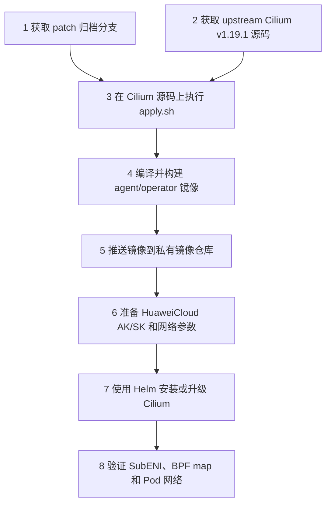

# HuaweiCloud Cilium Patch 安装部署说明

这份文档说明如何将 HuaweiCloud patch 应用到 upstream Cilium `v1.19.1`，构建镜像并部署到华为云 Kubernetes 集群。

本仓库只保存 patch，不包含 Cilium 源码和 Helm chart。请在干净的 upstream Cilium 源码上应用 patch。

## 1. 部署流程总览



部署分为两段：

- **准备源码和镜像**：把 HuaweiCloud 改动合入 Cilium 源码，构建 agent 和 operator
  镜像。
- **部署到集群**：用这些镜像安装 Cilium，并通过 `ipam.mode=huaweicloud` 启用
  HuaweiCloud IPAM。

## 2. 前置条件

### 2.1 本地工具

执行部署的机器需要有这些工具：

- `git`
- `bash`
- 与 Cilium `go.mod` 要求一致的 Go 工具链
- `make`
- `docker` 或兼容 Docker CLI 的构建工具
- `helm`
- `kubectl`

构建多架构镜像时，还需要 Docker Buildx builder。

### 2.2 Kubernetes 集群

目标集群至少要满足这些条件：

- 节点运行在华为云 ECS 上。
- 节点所在 VPC、子网、安全组允许创建辅助弹性网卡。
- 节点使用 trunk ENI 承载 SubENI VLAN 流量。
- 集群里不能同时运行另一个接管 Pod 网络的 CNI。
- kubelet 能正常调用 Cilium CNI。

部署账号还需要能在 `kube-system` 创建 Cilium 资源。执行 Helm 前先确认目标集群：

```bash
kubectl config current-context
kubectl cluster-info
```

如果是在已有集群上升级，先确认原 CNI 的迁移方案。CNI 切换会影响节点上已经运行的
Pod，生产集群不要直接试。

### 2.3 华为云信息

部署前把这些参数准备好：

| 参数 | 示例 | 说明 |
|---|---|---|
| `HUAWEI_CLOUD_ACCESS_KEY` | `AK...` | 调用华为云 API 的 AK |
| `HUAWEI_CLOUD_SECRET_KEY` | `SK...` | 调用华为云 API 的 SK |
| `HUAWEI_CLOUD_PROJECT_ID` | `0f...` | 华为云项目 ID，必填 |
| `HUAWEI_CLOUD_REGION` | `cn-north-4` | 区域；不填时会尝试从实例元数据推导 |
| `HUAWEI_CLOUD_VPC_ID` | `vpc-...` | VPC ID；不填时会尝试从实例元数据推导 |
| `HUAWEI_CLOUD_ENDPOINT` | `https://...` | 自定义 endpoint，公有云通常不用填 |
| trunk 网卡名 | `eth0` | 节点上承载 SubENI VLAN 的父网卡名 |
| SubENI 子网 ID | `subnet-...` | 用于创建辅助弹性网卡的子网 |
| VPC IPv4 CIDR | `192.168.0.0/16` | Cilium native routing CIDR；填 VPC IPv4 网段，不是 Pod CIDR |
| 安全组 ID | `sg-...` | 可选；不填时华为云会使用默认安全组，生产环境建议显式指定 |

请显式填写 `region`、`vpc id`、子网和安全组。这样能减少 metadata 或云侧权限问题的排查范围。

AK/SK 对应的华为云账号需要能查询 ECS、VPC、虚拟子网、安全组和端口，并创建、查询、删除 SubENI。权限不确定时，先让云平台管理员确认；不要在生产集群中用部署过程试权限。

### 2.4 工作目录

后续命令假定 patch 与 Cilium 源码位于同一个工作目录。将工作目录放在挂载盘；源码、Go 缓存、临时目录和镜像构建上下文都会写在这里。

```bash
export WORKDIR=<MOUNT_PATH>/cilium-v1.19.1-huaweicloud
mkdir -p "$WORKDIR"
cd "$WORKDIR"
```

`<MOUNT_PATH>` 请替换为实际挂载路径，例如 `/mnt/cilium-build`。后续步骤在同一个终端执行；重新打开终端时先重新设置 `WORKDIR`。

Docker/Buildx 的缓存不跟随 `WORKDIR`。如果要求所有构建产物都在挂载盘，Docker daemon 的 data-root 和 Buildx builder 存储也必须位于挂载盘；先用 `docker info -f '{{.DockerRootDir}}'` 确认。无法满足这一条件时，不要在该机器本地构建镜像。

## 3. 获取 patch 归档

```bash
git clone -b patch-archive/huaweicloud-v1.19.1 \
  https://github.com/lchany/huawei-cilium-v1.19.1.git \
  huawei-cilium-patches

cd huawei-cilium-patches
ls
```

目录里应该能看到：

```text
0001-huaweicloud-control-plane.patch
0002-huaweicloud-datapath-runtime.patch
0003-huaweicloud-generated-tests-docs.patch
0004-huaweicloud-reliability-fixes.patch
0005-huaweicloud-enable-subnet-tag-only-selection.patch
0006-huaweicloud-secure-operator-credential-injection.patch
apply.sh
series
README.md
INSTALL-DEPLOY.md
```

`series` 决定 patch 应用顺序。部署时不要修改它。

## 4. 准备 upstream Cilium 源码

这些 patch 只面向 Cilium `v1.19.1`，对应的基线 commit 是：

```text
d0d0c8792c3420b3a6739fa21e3a182827a0bbc6
```

回到工作目录后拉取源码并切到固定基线：

```bash
cd "$WORKDIR"
git clone https://github.com/cilium/cilium.git cilium
cd "$WORKDIR/cilium"
git checkout d0d0c8792c3420b3a6739fa21e3a182827a0bbc6
```

如果网络较慢，也可以只拉取 `v1.19.1` tag：

```bash
cd "$WORKDIR"
git clone --branch v1.19.1 --depth 1 https://github.com/cilium/cilium.git cilium
cd "$WORKDIR/cilium"
git rev-parse HEAD
```

`v1.19.1` tag 的 HEAD 也应该是：

```text
d0d0c8792c3420b3a6739fa21e3a182827a0bbc6
```

确认当前 commit：

```bash
git rev-parse HEAD
```

输出必须是：

```text
d0d0c8792c3420b3a6739fa21e3a182827a0bbc6
```

`apply.sh` 只接受这个基线提交。

## 5. 应用 HuaweiCloud patch

确认当前目录是 `$WORKDIR/cilium` 后执行：

```bash
"$WORKDIR/huawei-cilium-patches/apply.sh"
```

脚本会先做几项检查：

1. 检查当前目录是不是 Git 仓库根目录。
2. 检查 worktree 是否干净。
3. 按 `series` 顺序执行 `git am --3way`。

应用成功后查看提交：

```bash
git log --oneline --max-count=5
```

应该能看到类似提交：

```text
<commit> huaweicloud generated files tests and docs
<commit> huaweicloud datapath and runtime wiring
<commit> huaweicloud control plane integration
d0d0c8792c342 upstream v1.19.1 baseline
```

需要重试时，删除 `$WORKDIR/cilium` 后重新执行第 4 步和本节。不要在已经打过 patch 的源码树里重复执行。

## 6. 编译检查

下列命令会编译 Cilium。执行前清理上一次的编译缓存；源码目录、缓存和临时目录都在挂载盘的 `$WORKDIR` 内。

```bash
cd "$WORKDIR/cilium"
git clean -ffdx
rm -rf "$WORKDIR/.cache/go-build" "$WORKDIR/.tmp"
mkdir -p "$WORKDIR/.cache/go-build" "$WORKDIR/.tmp"
export GOCACHE="$WORKDIR/.cache/go-build"
export GOTMPDIR="$WORKDIR/.tmp"
export TMPDIR="$WORKDIR/.tmp"

make build-container
make build-container-operator-huaweicloud
```

再做 HuaweiCloud 相关单测：

```bash
go test -mod=vendor ./pkg/huaweicloud/...
go test -mod=vendor -tags ipam_provider_huaweicloud ./pkg/ipam/allocator/huaweicloud/...
```

完成检查后删除临时 Go 缓存；编译出的二进制仍在 `$WORKDIR/cilium`，不会写入系统盘。

```bash
rm -rf "$WORKDIR/.cache/go-build" "$WORKDIR/.tmp"
```

本机没有完整 Cilium 构建环境时，可以交给 CI 或镜像流水线。无论用哪种方式，operator 镜像必须包含：

```text
/usr/bin/cilium-operator-huaweicloud
```

## 7. 构建并推送镜像

下面使用 Cilium 原生 Makefile 构建镜像。将 registry 和 tag 换成实际值。

```bash
export DOCKER_REGISTRY=registry.example.com
export DOCKER_DEV_ACCOUNT=network
export DOCKER_IMAGE_TAG=v1.19.1-huaweicloud
export DOCKER_FLAGS=--push

make docker-cilium-image
make docker-operator-huaweicloud-image
```

构建后镜像名通常是：

```text
registry.example.com/network/cilium:v1.19.1-huaweicloud
registry.example.com/network/operator-huaweicloud:v1.19.1-huaweicloud
```

确认镜像已推送：

```bash
docker buildx imagetools inspect \
  registry.example.com/network/cilium:v1.19.1-huaweicloud

docker buildx imagetools inspect \
  registry.example.com/network/operator-huaweicloud:v1.19.1-huaweicloud
```

如果集群节点是 ARM64，构建时要使用多架构参数，例如：

```bash
export ARCH=multi
export DOCKER_FLAGS=--push
make docker-cilium-image
make docker-operator-huaweicloud-image
```

### 7.1 离线节点的镜像清单与导入

离线部署不能只导入 Agent 和 Operator。最终 Helm 渲染通常还会引用 `cilium-envoy`；Kubernetes
初始化还需要控制面、etcd、pause、CoreDNS 和 kube-proxy 镜像。先使用**最终** values 渲染，导出
完整镜像清单，再为目标架构准备镜像。

```bash
helm template cilium ./install/kubernetes/cilium \
  --namespace kube-system \
  -f huaweicloud-values.yaml \
  | awk '/^[[:space:]]*image:/{print $2}' \
  | tr -d '"' | sort -u > required-images.txt
```

对清单中的每个镜像制作单架构 OCI archive。以下以 amd64 为例；`IMAGE` 必须保持原始的完整
tag 或 tag@digest，不能自行改名：

```bash
export IMAGE=<required-images.txt 中的一行>
skopeo copy --override-os linux --override-arch amd64 \
  "docker://${IMAGE}" "oci-archive:${IMAGE##*/}.oci.tar:${IMAGE}"
```

在每个需要运行该镜像的节点导入。containerd 环境使用原始完整引用作为 `--index-name`，确保
kubelet 以 tag@digest 拉取时能命中本地镜像：

```bash
sudo ctr -n k8s.io images import --platform linux/amd64 \
  --index-name "$IMAGE" - < "${IMAGE##*/}.oci.tar"
sudo crictl images | grep -F "${IMAGE%%@*}"
```

镜像 archive、containerd 内容库和临时渲染文件也属于构建/部署产物。若执行环境要求产物只落在
挂载盘，先确认它们都位于挂载盘；不要在系统盘或默认 Docker data-root 下制作 archive。

## 8. 准备 HuaweiCloud Secret

在集群中创建或更新 Secret。AK/SK 不要写进 Helm 命令行。

```bash
kubectl -n kube-system create secret generic cilium-huaweicloud \
  --from-literal=HUAWEI_CLOUD_ACCESS_KEY='<AK>' \
  --from-literal=HUAWEI_CLOUD_SECRET_KEY='<SK>' \
  --from-literal=HUAWEI_CLOUD_PROJECT_ID='<PROJECT_ID>' \
  --from-literal=HUAWEI_CLOUD_REGION='<REGION>' \
  --from-literal=HUAWEI_CLOUD_VPC_ID='<VPC_ID>' \
  --dry-run=client -o yaml | kubectl apply -f -
```

需要自定义 endpoint 时，创建 Secret 时一起加上：

```bash
kubectl -n kube-system create secret generic cilium-huaweicloud \
  --from-literal=HUAWEI_CLOUD_ACCESS_KEY='<AK>' \
  --from-literal=HUAWEI_CLOUD_SECRET_KEY='<SK>' \
  --from-literal=HUAWEI_CLOUD_PROJECT_ID='<PROJECT_ID>' \
  --from-literal=HUAWEI_CLOUD_REGION='<REGION>' \
  --from-literal=HUAWEI_CLOUD_VPC_ID='<VPC_ID>' \
  --from-literal=HUAWEI_CLOUD_ENDPOINT='<ENDPOINT>' \
  --dry-run=client -o yaml | kubectl apply -f -
```

生产环境请改用 Secret YAML、SealedSecret 或外部密钥系统管理。

## 9. 编写 Helm values

创建 `huaweicloud-values.yaml`：

```yaml
image:
  repository: registry.example.com/network/cilium
  tag: v1.19.1-huaweicloud
  pullPolicy: IfNotPresent

operator:
  image:
    repository: registry.example.com/network/operator
    tag: v1.19.1-huaweicloud
    pullPolicy: IfNotPresent

  extraEnv:
    - name: HUAWEI_CLOUD_ACCESS_KEY
      valueFrom:
        secretKeyRef:
          name: cilium-huaweicloud
          key: HUAWEI_CLOUD_ACCESS_KEY
    - name: HUAWEI_CLOUD_SECRET_KEY
      valueFrom:
        secretKeyRef:
          name: cilium-huaweicloud
          key: HUAWEI_CLOUD_SECRET_KEY
    - name: HUAWEI_CLOUD_PROJECT_ID
      valueFrom:
        secretKeyRef:
          name: cilium-huaweicloud
          key: HUAWEI_CLOUD_PROJECT_ID
    - name: HUAWEI_CLOUD_REGION
      valueFrom:
        secretKeyRef:
          name: cilium-huaweicloud
          key: HUAWEI_CLOUD_REGION
    - name: HUAWEI_CLOUD_VPC_ID
      valueFrom:
        secretKeyRef:
          name: cilium-huaweicloud
          key: HUAWEI_CLOUD_VPC_ID

ipam:
  mode: huaweicloud

# HuaweiCloud IPAM 只能使用 native routing。
routingMode: native
enableIPv4Masquerade: false
ipv4NativeRoutingCIDR: <VPC_IPV4_CIDR>

# 三处网卡名必须一致：devices、directRoutingDevice 和 Huawei trunk flag。
devices:
  - eth0
nodePort:
  directRoutingDevice: eth0

extraArgs:
  - "--huawei-cloud-trunk-interface=eth0"
  - "--huawei-cloud-subnet-ids=<SUBNET_ID_1>,<SUBNET_ID_2>"
  - "--huawei-cloud-security-group-ids=<SECURITY_GROUP_ID_1>,<SECURITY_GROUP_ID_2>"
```

把 `<VPC_IPV4_CIDR>` 换成 VPC 的 IPv4 网段，例如 `192.168.0.0/16`。不要填 Pod CIDR 或单个 SubENI 子网。`eth0` 只是示例；如果 trunk 网卡不是 `eth0`，同时修改 `devices`、`nodePort.directRoutingDevice` 和 `--huawei-cloud-trunk-interface`。

生产和真实环境测试应显式设置 `--huawei-cloud-security-group-ids=...`。首次创建 SubENI
时空配置会由云侧选择默认安全组，规则往往无法满足 Pod、CoreDNS 与 Cilium health 的
双向通信要求，排查成本很高。只有已单独验证默认安全组规则时，才删除这一行。

Pod 安全组至少应按最小权限允许 VPC/Pod 子网内的双向通信；测试阶段还应覆盖 ICMP、TCP、
UDP、DNS（53）和 Cilium health（4240）。不要为了排障临时开放 `0.0.0.0/0` 全端口；新增
或修改规则前须记录规则 ID、作用范围与回滚时间。

### 9.1 按子网标签选择 SubENI 子网

需要按标签而不是固定 ID 选择子网时，在每个节点的 Cilium CNI 配置中设置
`huawei-cloud.subnet-tags`。下面以宿主机
`/etc/cni/net.d/04-cilium-cni-eni.conf` 为例；先确保该文件已经由运维系统分发到所有
目标节点。

```json
{
  "cniVersion": "0.3.1",
  "name": "cilium",
  "type": "cilium-cni",
  "huawei-cloud": {
    "subnet-tags": {
      "network-role": "pod"
    }
  }
}
```

Helm values 必须让 Agent 读取宿主机文件，同时关闭自动覆盖自定义 CNI 配置：

```yaml
cni:
  customConf: true
  readCniConf: /host/etc/cni/net.d/04-cilium-cni-eni.conf
```

按标签选择时，从 `extraArgs` 删除 `--huawei-cloud-subnet-ids=...`。如果 ID 和标签同时
存在，显式 `subnet-ids` 优先，标签不会参与筛选。安全组仍可继续通过
`--huawei-cloud-security-group-ids` 指定。

配置文件也可以是 `.conflist`；此时把相同的 `huawei-cloud` 对象放在
`plugins` 数组中 `type: cilium-cni` 的插件对象内，并让 `cni.readCniConf` 指向该文件。

安装或滚动重启 Agent 后检查：

```bash
kubectl get ciliumnodes -o yaml | grep -A12 'subnet-tags'
```

预期每个节点的 `spec.huawei-cloud.subnet-tags` 都与 CNI 文件一致。再创建 Pod，并在华为云
控制台或 API 中确认新 SubENI 位于标签匹配、VPC 和可用区均正确的子网。仅修改宿主机
CNI 文件但不设置 `cni.readCniConf` 不会生效。

使用自定义 endpoint 时，在 `operator.extraEnv` 里再加：

```yaml
    - name: HUAWEI_CLOUD_ENDPOINT
      valueFrom:
        secretKeyRef:
          name: cilium-huaweicloud
          key: HUAWEI_CLOUD_ENDPOINT
```

当 `ipam.mode=huaweicloud` 时，Helm 会将 `operator.image.repository` 组合为 `operator-huaweicloud:<tag>`。因此这里的 repository 要保留基础名 `registry.example.com/network/operator`。如需指定完整镜像名，使用 `operator.image.override`。

使用完整镜像名的写法：

```yaml
operator:
  image:
    override: registry.example.com/network/operator-huaweicloud:v1.19.1-huaweicloud
```

Operator 从 Secret 读取 `HUAWEI_CLOUD_*` 环境变量；当前 patch 同时兼容
`CILIUM_HUAWEI_CLOUD_*`，后者优先。不要再把 `$(HUAWEI_CLOUD_...)` 写到
`operator.extraArgs`：这会把凭据展开到 Pod 参数中。

安装前先渲染 chart；渲染失败时不要执行升级命令。

```bash
cd "$WORKDIR/cilium"
helm template cilium ./install/kubernetes/cilium \
  --namespace kube-system \
  -f huaweicloud-values.yaml > cilium-rendered.yaml

grep -n 'HUAWEI_CLOUD_ACCESS_KEY\|huawei-cloud-access-key' cilium-rendered.yaml
```

渲染结果中应只出现 `HUAWEI_CLOUD_ACCESS_KEY` 的 Secret 引用，不能出现
`--huawei-cloud-access-key=` 或 AK/SK 明文。

## 10. 安装 Cilium

在已经应用 patch 的 Cilium 源码目录中执行：

```bash
cd "$WORKDIR/cilium"
helm upgrade --install cilium ./install/kubernetes/cilium \
  --namespace kube-system \
  -f huaweicloud-values.yaml
```

等待组件启动：

```bash
kubectl -n kube-system rollout status ds/cilium
kubectl -n kube-system rollout status deploy/cilium-operator
```

确认 operator 启动的是 HuaweiCloud 变体：

```bash
kubectl -n kube-system get deploy cilium-operator -o jsonpath='{.spec.template.spec.containers[0].command}'
echo
```

输出应包含：

```text
cilium-operator-huaweicloud
```

## 11. 部署后验证

### 11.1 基础状态

```bash
kubectl -n kube-system get pods -o wide
kubectl -n kube-system exec ds/cilium -- cilium status
```

确认这些状态：

- `cilium` DaemonSet 全部 Ready。
- `cilium-operator` Deployment Ready。
- `cilium status` 没有报错。

### 11.2 检查 CiliumNode

```bash
kubectl get ciliumnodes -o yaml | grep -A30 'huawei-cloud'
```

应能看到：

- `spec.huawei-cloud` 中有 instance、VPC、trunk interface、subnet、安全组等节点信息。
- `status.huawei-cloud.subenis` 中逐步出现已分配的 SubENI。

如果 `spec.huawei-cloud` 为空，先检查 agent 的 trunk、子网和安全组参数，再检查节点能否访问华为云 metadata。

### 11.3 检查 BPF map

创建一个测试 Pod：

```bash
kubectl create ns hwc-test --dry-run=client -o yaml | kubectl apply -f -
kubectl -n hwc-test run curl --image=curlimages/curl -- sleep 3600
kubectl -n hwc-test wait pod/curl --for=condition=Ready --timeout=120s
```

查看 BPF map：

```bash
kubectl -n kube-system exec ds/cilium -- cilium-dbg bpf map list | grep cilium_hwc
```

应该能看到：

```text
cilium_hwc_srcip4
cilium_hwc_vlan_mac
```

如果 map 存在但没有条目，检查测试 Pod 是否已经拿到 HuaweiCloud SubENI/IP，再看
operator 是否把 SubENI 状态写到了 `CiliumNode.status.huawei-cloud`。

### 11.4 验证 Pod 网络

在测试 Pod 里验证 DNS、Service 和外部访问：

```bash
kubectl -n hwc-test exec curl -- nslookup kubernetes.default.svc.cluster.local
kubectl -n hwc-test exec curl -- curl -k https://kubernetes.default.svc
kubectl -n hwc-test exec curl -- curl -I https://www.huaweicloud.com
```

集群启用了 NetworkPolicy 时，再执行一条允许与一条拒绝规则，确认策略仍生效。入方向流量去 VLAN 后会回到 Cilium 原生 datapath。

### 11.5 删除 Pod 后验证回收

```bash
kubectl -n hwc-test delete pod curl
kubectl get ciliumnodes -o yaml | grep -A30 'huawei-cloud'
```

观察 SubENI/IP 状态是否回收，BPF map 中对应 Pod IP 的条目是否删除。

## 12. 升级已有安装

如果集群已经运行 Cilium，先记录当前版本和配置：

1. 记录当前 Helm values。
2. 构建 HuaweiCloud patch 版本镜像。
3. 在测试集群验证。
4. 业务低峰期执行 `helm upgrade`。
5. 滚动观察每个节点上的 `cilium` Pod、Pod 网络和策略行为。

导出现有 values：

```bash
helm -n kube-system get values cilium -o yaml > current-values.yaml
```

把 HuaweiCloud 配置合并到现有 values 后再升级：

```bash
helm upgrade cilium ./install/kubernetes/cilium \
  --namespace kube-system \
  -f current-values.yaml \
  -f huaweicloud-values.yaml
```

不要用本文档的最小 values 覆盖生产配置。现有 kube-proxy replacement、路由、Hubble、MTU 和 policy 配置都要保留。

## 13. 回滚

Helm upgrade 失败时，先查看历史版本：

```bash
helm -n kube-system history cilium
```

回滚到上一个可用版本：

```bash
helm -n kube-system rollback cilium <REVISION>
```

回滚后检查：

```bash
kubectl -n kube-system rollout status ds/cilium
kubectl -n kube-system rollout status deploy/cilium-operator
kubectl -n kube-system get pods -o wide
```

如果已经创建了 SubENI，回滚前后要确认这些云资源由谁管理。没确认清楚前，不要直接批量
删除云上 SubENI，先根据 `CiliumNode.status.huawei-cloud` 和华为云控制台核对归属。

## 14. 常见问题

### 14.1 `wrong baseline`

现象：

```text
wrong baseline: got <commit>, expected d0d0c8792c3420b3a6739fa21e3a182827a0bbc6
```

这是因为当前 Cilium 源码不在指定基线。处理方式：

```bash
cd "$WORKDIR/cilium"
git checkout d0d0c8792c3420b3a6739fa21e3a182827a0bbc6
"$WORKDIR/huawei-cilium-patches/apply.sh"
```

只有在迁移 patch 到新 Cilium 版本时，才考虑 `--no-base-check`。

### 14.2 `refusing to apply patches on a dirty worktree`

这说明当前 Cilium 源码里有未提交改动。换一份干净源码，或者先提交自己的改动。

```bash
git status --short
```

不要为了省事在脏 worktree 上强行打 patch。后面遇到冲突时，很难判断问题是谁引入的。

### 14.3 operator 没有按 HuaweiCloud 模式启动

常见原因：

- operator 镜像里没有 `cilium-operator-huaweicloud`。
- Helm 没有设置 `ipam.mode=huaweicloud`。
- operator 启动命令不是 `cilium-operator-huaweicloud`。

检查：

```bash
kubectl -n kube-system get deploy cilium-operator -o yaml | grep cilium-operator
```

### 14.4 operator 报缺少 AK/SK/ProjectID

常见原因：

- Secret 没创建在 `kube-system`。
- Secret key 名称写错。
- `operator.extraEnv` 没有生效。

检查：

```bash
kubectl -n kube-system get secret cilium-huaweicloud
kubectl -n kube-system get deploy cilium-operator -o yaml | grep HUAWEI_CLOUD
```

不要用 `kubectl get secret -o yaml`、`printenv` 或带 `--previous` 的全量日志把凭据写入
工单。确认 Secret key 是否存在时，只检查 key 名和长度；Operator 启动配置日志中的 AK/SK
应显示为 `<redacted>`。

### 14.5 跨节点 Pod、CoreDNS 或 Cilium health 不通

按以下顺序排查，避免把安全组、VPC 路由与 BPF 问题混在一起：

1. 确认每个 `CiliumNode.status.huawei-cloud.subenis` 中的 Pod/health IP、VLAN、MAC、网关
   与云侧 SubENI 一致。
2. 在所有节点确认 `cilium_hwc_srcip4`、`cilium_hwc_vlan_mac` 有对应 endpoint 条目。
3. 在云侧确认每个 SubENI 都绑定了 values 中显式指定的安全组，并复核 VPC/Pod 子网内的
   双向规则、DNS 和 4240 端口。
4. 确认 `ipv4NativeRoutingCIDR` 是整个 VPC CIDR，且 trunk、`devices`、
   `nodePort.directRoutingDevice` 三处网卡名一致。
5. 收集 `cilium-dbg health status --verbose`、endpoint 列表和相关时间段的 Agent 日志；在
   未确认安全组前不要修改 BPF 程序或扩大安全组范围。

### 14.6 `CiliumNode.spec.huawei-cloud` 为空

优先检查：

- agent 是否带了 `--huawei-cloud-trunk-interface`。
- 节点上 trunk 网卡名是否真的是 `eth0`。
- `devices` 和 `nodePort.directRoutingDevice` 是否与 trunk 网卡名相同。
- 子网 ID、安全组 ID 是否正确。
- 节点是否能访问华为云 metadata 服务。

### 14.7 BPF map 没有 HuaweiCloud 条目

先看三个对象：

```bash
kubectl get ciliumnodes -o yaml | grep -A30 'huawei-cloud'
kubectl -n kube-system logs deploy/cilium-operator | grep -i huaweicloud
kubectl -n kube-system logs ds/cilium | grep -i huaweicloud
```

判断顺序：

1. `CiliumNode.status.huawei-cloud.subenis` 是否有 SubENI。
2. 测试 Pod 是否拿到了 SubENI 对应的 Pod IP。
3. endpoint manager 是否把 Pod/SubENI 映射写入 `cilium_hwc_srcip4` 和 `cilium_hwc_vlan_mac`。

### 14.8 Pod 出网不通

优先检查：

- trunk 网卡名是否配置正确。
- SubENI 的 VLAN ID、MAC 是否出现在 `CiliumNode.status.huawei-cloud`。
- 安全组是否允许目标流量。
- 子网路由、NAT 或出口网关是否符合预期。
- `cilium_hwc_srcip4` 是否有这个 Pod IP 对应条目。

### 14.9 Pod 入方向策略不生效

这个 patch 要求入方向流量去 VLAN 后回到 Cilium 原生 datapath。排查时重点看：

- 当前部署的 patch 是否是最新版本。
- BPF 代码是否仍然存在直接 `redirect` 到 Pod 的旧逻辑。
- Cilium NetworkPolicy 是否正常下发。
- `cilium monitor` 或 Hubble 中是否能看到对应流量。

## 15. 交付检查清单

交付前逐项确认：

- patch 是从 `patch-archive/huaweicloud-v1.19.1` 分支获取。
- Cilium 基线是 `d0d0c8792c3420b3a6739fa21e3a182827a0bbc6`。
- `apply.sh` 执行成功。
- agent 镜像已构建并推送。
- operator 镜像已构建并推送，且包含 `cilium-operator-huaweicloud`。
- Helm values 中设置了 `ipam.mode=huaweicloud`。
- Helm values 中设置了 `routingMode: native`、`ipv4NativeRoutingCIDR`，且三处 trunk 网卡配置一致。
- AK/SK/ProjectID 通过 Secret 注入，不写在明文命令行里。
- `CiliumNode.spec.huawei-cloud` 正常出现节点网络信息。
- `CiliumNode.status.huawei-cloud` 正常出现 SubENI/IP/VLAN/MAC。
- `cilium_hwc_srcip4` 和 `cilium_hwc_vlan_mac` 正常创建并有条目。
- Pod DNS、Service、跨节点访问和外部访问正常。
- 如果使用 NetworkPolicy，策略验证通过。
