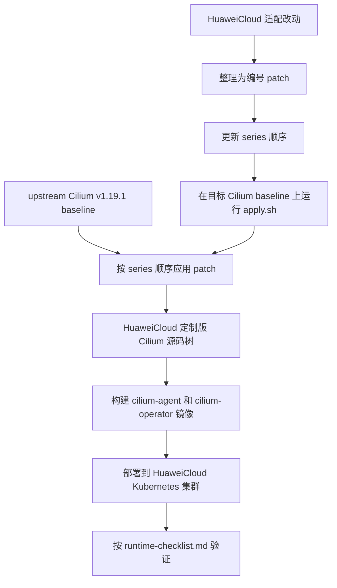
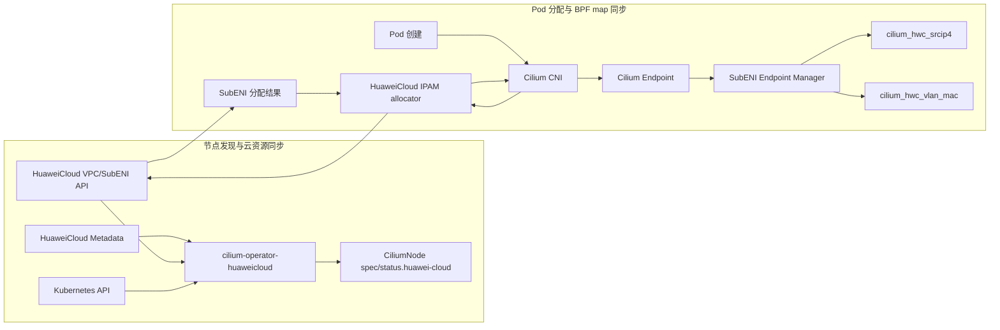

# HuaweiCloud Cilium Patch Archive

这个项目用于管理 HuaweiCloud/SubENI 对 Cilium `v1.19.1` 的适配改动。

它的目标不是维护一份完整的 Cilium fork，而是把 HuaweiCloud 相关修改整理成
patch series。需要构建 HuaweiCloud 版本 Cilium 时，将这些 patch 按顺序应用到
干净的 upstream Cilium `v1.19.1` 源码上。

本项目对外 **不提供 Cilium 源码**。使用方需要自行准备合法获取的 upstream Cilium
`v1.19.1` 源码，本项目只提供 HuaweiCloud 适配 patch。

这种方式解决的是 **源码管理方式解耦**：

- Cilium upstream 源码作为独立基线存在。
- HuaweiCloud 适配逻辑以 patch 文件归档。
- 对外交付内容不包含 Cilium 源码树。
- 后续升级 Cilium 时，可以重新审查和迁移这些 patch。
- patch 应用后仍然会修改 Cilium 源码，这一点和 Terway 的 Cilium patch 管理方式一致。

## 基线版本

这些 patch 面向以下 Cilium 基线：

- upstream tag: `v1.19.1`
- commit: `d0d0c8792c3420b3a6739fa21e3a182827a0bbc6`

`apply.sh` 默认会检查目标仓库是否处于这个 commit，避免 patch 打到错误版本。

## 目录说明

```text
.
├── 0001-huaweicloud-control-plane.patch
├── 0002-huaweicloud-datapath-runtime.patch
├── 0003-huaweicloud-generated-tests-docs.patch
├── series
├── apply.sh
├── runtime-checklist.md
└── README.md
```

- `series`：patch 应用顺序。
- `apply.sh`：在干净的 Cilium 源码树中按 `series` 应用 patch。
- `runtime-checklist.md`：部署后需要验证的基础运行时场景。

## Patch 管理流程



这个项目只保存图中的“编号 patch、series、应用脚本”。Cilium 源码本身不保存在这个
分支里。

## HuaweiCloud 插件原理

HuaweiCloud 适配分为控制面和数据面两部分：

- 控制面负责发现 ECS/VPC/子网/trunk ENI 信息，调用 HuaweiCloud API 创建和释放
  SubENI，并把 Pod 与 SubENI 的关系写入 CiliumNode 和 BPF map。
- 数据面负责在 trunk 网卡上处理 SubENI VLAN 流量。Pod 出方向打 VLAN、改写 SubENI
  MAC；Pod 入方向识别 VLAN、去 VLAN 后交回 Cilium 原生 datapath，继续走连接跟踪、
  NetworkPolicy 和本地投递逻辑。

### 控制面流程



关键状态：

- `CiliumNode.spec.huawei-cloud`：记录节点侧实例、VPC、trunk ENI、子网、安全组等信息。
- `CiliumNode.status.huawei-cloud`：记录已分配的 SubENI/IP/VLAN/MAC 等运行时状态。
- `cilium_hwc_srcip4`：Pod IP 到 SubENI VLAN/MAC 的映射，供 egress 使用。
- `cilium_hwc_vlan_mac`：VLAN + SubENI MAC 到 endpoint 的映射，供 ingress 识别本地
  SubENI 流量。

### 数据面流程

```mermaid
flowchart TB
    subgraph egress["Pod 出方向"]
        epod["Pod 发包"]
        elxc["bpf_lxc / endpoint datapath"]
        ect["Cilium CT / policy / service 逻辑"]
        eto["bpf_host: cil_to_netdev"]
        esrc["查询 cilium_hwc_srcip4"]
        evlan["改源 MAC 并 push VLAN"]
        etrunk["trunk ENI 发出"]

        epod --> elxc --> ect --> eto --> esrc --> evlan --> etrunk
    end

    subgraph ingress["Pod 入方向"]
        itrunk["trunk ENI 收到 VLAN 包"]
        ifrom["bpf_host: cil_from_netdev"]
        imap["查询 cilium_hwc_vlan_mac"]
        ipop["pop VLAN 并修正 PACKET_HOST"]
        inative["回到 Cilium 原生 datapath"]
        ict["Cilium CT / ingress policy / proxy"]
        ideliver["local delivery 到目标 Pod"]

        itrunk --> ifrom --> imap --> ipop --> inative --> ict --> ideliver
    end
```



入方向的关键原则是：HuaweiCloud 逻辑不直接 `redirect` 到 Pod，只做 VLAN 归一化，
然后回到 Cilium 原生路径。这样可以保留 Cilium 的连接跟踪、NetworkPolicy、L7 proxy
和观测能力。

## Patch 说明

### 0001-huaweicloud-control-plane.patch

管理面适配 patch。

这个 patch 负责把 HuaweiCloud 作为一种 Cilium IPAM/云厂商后端接入到控制面。

主要内容：

- 增加 `huaweicloud` IPAM mode。
- 扩展 `CiliumNode` 中的 HuaweiCloud/SubENI 字段。
- 增加 HuaweiCloud VPC/SubENI API client、错误处理和类型定义。
- 增加 SubENI allocator、节点实例信息、配额、metadata 查询逻辑。
- 在 node discovery 中写入 HuaweiCloud 节点、VPC、子网、trunk ENI 等信息。
- 增加 SubENI endpoint manager，用于维护 Pod 与 SubENI/VLAN/MAC 的关系。
- 接入 operator、Helm、RBAC 和构建入口。

它主要影响 Cilium 的 operator、IPAM、CiliumNode CRD、HuaweiCloud API 封装和
SubENI 分配管理逻辑。

### 0002-huaweicloud-datapath-runtime.patch

数据面和运行时接线 patch。

这个 patch 负责让 HuaweiCloud SubENI 分配结果进入 Cilium datapath，并在 BPF 中处理
SubENI VLAN 流量。

主要内容：

- 增加 HuaweiCloud VLAN BPF datapath。
- 在 egress 路径中根据 Pod IP 查找 SubENI 信息，改写源 MAC 并 push VLAN。
- 在 ingress 路径中识别 trunk 网卡上的 SubENI VLAN 包，pop VLAN 后交回 Cilium 原生
  datapath。
- 增加 HuaweiCloud 相关 BPF map、drop reason 和 monitor 展示。
- 将 CNI 返回的 gateway、CIDR、VLAN ID、MAC 等结果传递给 daemon/datapath。
- 接入 endpoint、health endpoint、iptables、node config 等运行时路径。
- 增加 Kubernetes Endpoint / EndpointSlice 兼容处理。

它主要影响 Cilium 的 BPF 代码、CNI 接线、daemon datapath 配置、endpoint 运行时状态
和 K8s service/endpoints 兼容逻辑。

### 0003-huaweicloud-generated-tests-docs.patch

生成物、依赖、测试和文档 patch。

这个 patch 不承载主要业务逻辑，主要用于补齐前两个 patch 引入的依赖和验证材料。

主要内容：

- 更新 `go.mod` / `go.sum`。
- 增加 HuaweiCloud SDK 等 vendor 依赖。
- 更新 CRD yaml、deepcopy、deepequal 等 generated 文件。
- 增加 HuaweiCloud API、allocator、metadata、SubENI map、IPAM、EndpointSlice 等单测。
- 增加 HuaweiCloud Cilium README 和技术说明文档。

它主要用于保证代码生成、依赖 vendoring、测试覆盖和文档说明完整。

## 应用方式

准备干净的 upstream Cilium 源码。该源码由使用方自行获取，本项目不提供：

```bash
git clone https://github.com/cilium/cilium.git cilium-v1.19.1
cd cilium-v1.19.1
git checkout d0d0c8792c3420b3a6739fa21e3a182827a0bbc6
```

从 Cilium 仓库根目录执行本项目中的 `apply.sh`：

```bash
/path/to/patch-archive/apply.sh
```

脚本会按 `series` 顺序应用三个 patch。

## 边界说明

这个项目不是运行时插件，也不是独立 CNI 实现。

它只是 HuaweiCloud 对 Cilium 的源码改动归档，不包含 Cilium 源码。patch 应用后，
使用方本地的 Cilium 源码仍会被修改，包括 Go 控制面代码、BPF 数据面代码、Helm/RBAC、
generated 文件和 vendor 依赖。

后续升级 Cilium 时，应以 `series` 中的 patch 为迁移单元，逐个检查是否仍然需要、
是否可以上游化、是否需要重写。
